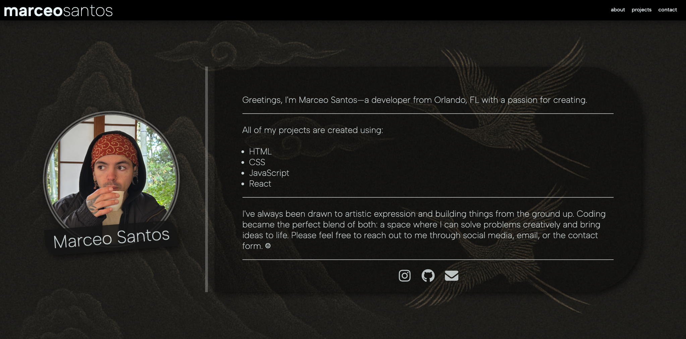

# Marceo Santos - Portfolio

[](https://forthebadge.com)

[](https://forthebadge.com)



Thank you for visiting my portfolio, and I hope I can meet all of your coding needs and expectations! For any questions that you may have, feel free to contact me using the various contact options on my portfolio website or GitHub profile. Thank you!

## This project was built using:

- React.js
- Node.js
- Vite
- CSS3
- Tailwind CSS
- VsCode
- Git

## Features

Fully Responsive

Styled fully with CSS3

## How to Open

Click the link in the description to view in browser.

## Installation

Follow these steps:

1. Make sure you have the following installed on your machine:

```
- Git
- NodeJS
- npm (Node Package Manager)
```

2. Cloning the Repository

```
git clone https://github.com/marceosayo/Portfolio.git
cd website-portfolio
npm install
npm run dev
```
